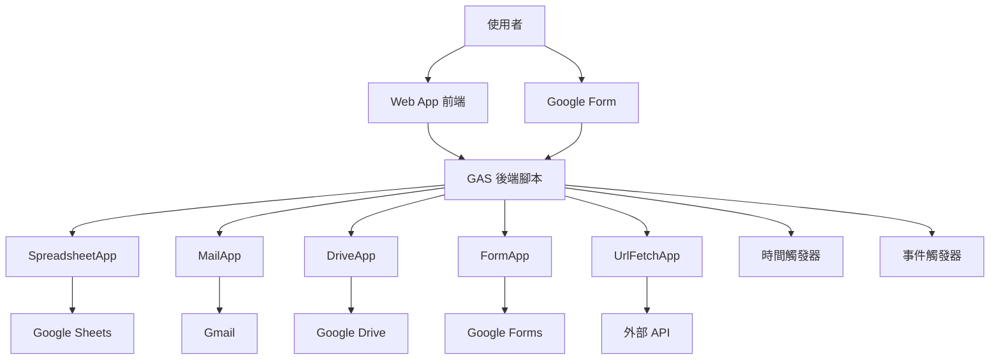
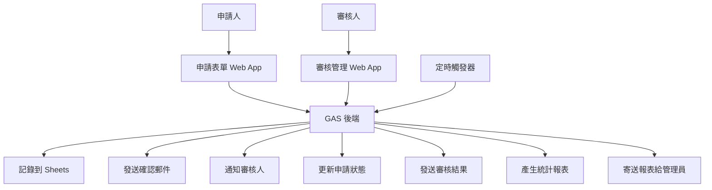
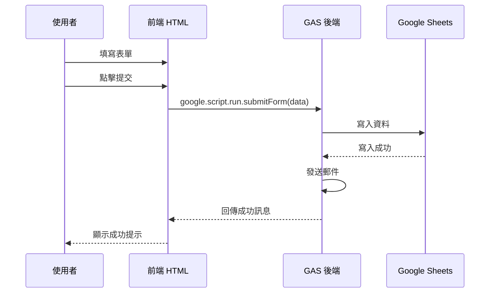

# 課程設計文件

## 概述

本文件詳細規劃一門 54 小時的 Google Apps Script（GAS）+ JavaScript 應用型課程。課程採用「學語法 + 做產品」並重的教學理念，讓程式初學者能夠在學習 JavaScript 基礎語法的同時，透過實作真實的自動化與雲端整合應用來鞏固所學。

課程特色：
- 針對程式初學者設計，從零開始教授 JavaScript
- 明確標註 GAS 對各種 JavaScript 語法的支援情況
- 提供 10 個完整實作案例，涵蓋 Google Workspace 生態系統
- 實作時數佔比超過 60%，強調動手做
- 課程結束後學習者能獨立開發自動化工具與小型 Web App

## 課程架構

### 整體時數分配（總計 54 小時）

| 單元編號 | 單元名稱 | 理論時數 | 實作時數 | 總時數 |
|---------|---------|---------|---------|--------|
| 1 | 認識 Apps Script 與 JavaScript 基礎 | 4 | 6 | 10 |
| 2 | 操作 Google Sheets | 2 | 4 | 6 |
| 3 | 自動寄信與通知 | 1.5 | 2.5 | 4 |
| 4 | 檔案與雲端操作 | 2 | 4 | 6 |
| 5 | 表單整合 | 1.5 | 2.5 | 4 |
| 6 | 建立簡易 Web App | 3 | 5 | 8 |
| 7 | API 整合應用 | 2 | 4 | 6 |
| 8 | 綜合實作展示 | 2 | 8 | 10 |
| **總計** | | **18** | **36** | **54** |

實作時數佔比：36/54 = 66.7%（符合需求 11.3）


## 單元 1：認識 Apps Script 與 JavaScript 基礎（10 小時）

### 學習目標
- 了解 Google Apps Script 的特性與應用場景
- 掌握 JavaScript 基礎語法（變數、資料型別、運算子、流程控制、函式、陣列、物件、字串、錯誤處理）
- 理解 GAS 對 JavaScript 語法的支援情況
- 能夠撰寫簡單的 GAS 腳本

### 教學內容大綱

#### 1.1 認識 Google Apps Script（1 小時）
- GAS 簡介與應用場景
- GAS 編輯器介面導覽
- 第一個 Hello World 程式
- GAS 執行環境與限制
- V8 runtime 介紹與啟用方式

#### 1.2 JavaScript 變數與資料型別（1.5 小時）
**理論講解（0.5 小時）：**
- 變數宣告：var、let、const
  - ✅ GAS 完全支援：var
  - ⚠️ 需 V8 runtime：let、const
- 基本資料型別：String、Number、Boolean、Null、Undefined
  - ✅ GAS 完全支援所有基本型別
- 算術、比較、邏輯運算子
  - ✅ GAS 完全支援

**實作練習（1 小時）：**
- 10 個變數與運算子練習題
- 使用 Logger.log() 輸出結果
- 練習題範例：計算成績平均、判斷及格與否、字串連接等

#### 1.3 流程控制（2 小時）
**理論講解（0.5 小時）：**
- if-else 條件判斷（單層、多層、巢狀）
  - ✅ GAS 完全支援
- switch-case 語法
  - ✅ GAS 完全支援
- for、while、do-while 迴圈
  - ✅ GAS 完全支援
- break 與 continue
  - ✅ GAS 完全支援
- for...of 迴圈
  - ⚠️ 需 V8 runtime（提供傳統 for 迴圈替代方案）

**實作練習（1.5 小時）：**
- 15 個流程控制練習題
- 練習題範例：九九乘法表、質數判斷、陣列遍歷、成績等級判定等


#### 1.4 函式（1.5 小時）
**理論講解（0.5 小時）：**
- 函式定義與呼叫
  - ✅ GAS 完全支援傳統函式語法
- 參數傳遞與回傳值
- 函式命名規範
- 函式作用域（Scope）
  - ✅ GAS 完全支援
- 箭頭函式（Arrow Function）
  - ⚠️ 需 V8 runtime

**實作練習（1 小時）：**
- 10 個函式練習題（從簡單到複雜）
- 練習題範例：計算函式、字串處理函式、陣列操作函式等

#### 1.5 陣列操作（1.5 小時）
**理論講解（0.5 小時）：**
- 陣列建立、存取、修改
  - ✅ GAS 完全支援
- 常用陣列方法：push、pop、shift、unshift、splice、slice
  - ✅ GAS 完全支援
- 陣列遍歷：forEach、map、filter、reduce
  - ✅ GAS 完全支援
- 不支援的方法：flat、flatMap、includes
  - ⚠️ 需 V8 runtime
- 多維陣列
  - ✅ GAS 完全支援

**實作練習（1 小時）：**
- 12 個陣列操作練習題
- 練習題範例：陣列排序、過濾、轉換、統計等

#### 1.6 物件與字串（1.5 小時）
**理論講解（0.5 小時）：**
- 物件建立、屬性存取、方法定義
  - ✅ GAS 完全支援
- 物件遍歷：for...in、Object.keys()
  - ✅ GAS 完全支援
- JSON 格式：JSON.stringify、JSON.parse
  - ✅ GAS 完全支援
- 物件解構與展開運算子
  - ⚠️ 需 V8 runtime
- 字串操作：連接、常用方法（length、indexOf、substring、slice、split、replace）
  - ✅ GAS 完全支援傳統字串操作
- 模板字串（Template Literals）
  - ⚠️ 需 V8 runtime

**實作練習（1 小時）：**
- 10 個物件操作練習題
- 8 個字串處理練習題

#### 1.7 錯誤處理與除錯（1 小時）
**理論講解（0.5 小時）：**
- try-catch-finally 語法
  - ✅ GAS 完全支援
- 常見錯誤類型
- Logger.log() 除錯
  - ✅ GAS 完全支援
- console.log() 除錯
  - ⚠️ 需 V8 runtime

**實作練習（0.5 小時）：**
- 5 個錯誤處理實作範例

### 單元 1 產出
- 完成 70+ 個 JavaScript 基礎練習題
- 建立個人 GAS JavaScript 語法支援筆記


## 單元 2：操作 Google Sheets（6 小時）

### 學習目標
- 掌握 SpreadsheetApp 服務的核心方法
- 能夠讀取、寫入、格式化試算表資料
- 理解範圍（Range）操作的概念
- 完成學生成績登錄系統實作

### 教學內容大綱

#### 2.1 SpreadsheetApp 基礎（1 小時）
**理論講解（0.5 小時）：**
- SpreadsheetApp 服務架構
- 取得試算表：getActiveSpreadsheet()、openById()、openByUrl()
- 工作表操作：getSheetByName()、insertSheet()、deleteSheet()
- 範圍選取：getRange()、getDataRange()、getLastRow()、getLastColumn()

**實作練習（0.5 小時）：**
- 建立腳本讀取試算表資料
- 練習不同的範圍選取方法

#### 2.2 資料讀取與寫入（1.5 小時）
**理論講解（0.5 小時）：**
- 讀取資料：getValue()、getValues()
- 寫入資料：setValue()、setValues()
- 清除資料：clear()、clearContent()
- 批次操作的效能優化

**實作練習（1 小時）：**
- 讀取學生名單並處理
- 批次寫入成績資料
- 資料驗證與錯誤處理

#### 2.3 格式化與進階操作（1.5 小時）
**理論講解（0.5 小時）：**
- 格式設定：setNumberFormat()、setFontColor()、setBackground()
- 排序與篩選：sort()
- 公式操作：setFormula()
- 保護範圍：protect()

**實作練習（1 小時）：**
- 設定成績表格式
- 自動計算統計資料
- 條件格式化（及格/不及格）

#### 2.4 實作案例 1：學生成績登錄系統（2 小時）
**專案需求：**
- 建立學生成績輸入介面（使用 UI 對話框）
- 自動計算平均分數
- 根據分數自動標註等級（優/良/可/待加強）
- 產生班級成績統計報表
- 自動格式化（及格綠色、不及格紅色）

**技能整合：**
- JavaScript 陣列與物件操作
- SpreadsheetApp 讀寫操作
- 流程控制與函式應用
- 錯誤處理

### 單元 2 產出
- 完成學生成績登錄系統（實作案例 1）


## 單元 3：自動寄信與通知（4 小時）

### 學習目標
- 掌握 MailApp 與 GmailApp 服務
- 能夠撰寫自動寄信腳本
- 理解並設定時間觸發器（Trigger）
- 完成自動寄送通知信實作

### 教學內容大綱

#### 3.1 MailApp 與 GmailApp（1 小時）
**理論講解（0.5 小時）：**
- MailApp 基本方法：sendEmail()
- 郵件參數：收件者、主旨、內容、附件
- HTML 格式郵件
- GmailApp 進階功能：標籤、草稿、搜尋

**實作練習（0.5 小時）：**
- 發送簡單文字郵件
- 發送 HTML 格式郵件
- 發送帶附件的郵件

#### 3.2 時間觸發器（Trigger）（1 小時）
**理論講解（0.5 小時）：**
- 觸發器類型：時間驅動、事件驅動
- 設定定時執行：每小時、每天、每週
- 觸發器管理：建立、刪除、查看
- 觸發器限制與配額

**實作練習（0.5 小時）：**
- 建立每日定時執行的腳本
- 設定特定時間執行的任務
- 管理與刪除觸發器

#### 3.3 實作案例 2：自動寄送通知信（2 小時）
**專案需求：**
- 從試算表讀取待通知名單
- 根據不同條件發送客製化郵件
- 記錄寄送狀態與時間
- 設定每日自動檢查與寄送
- 錯誤處理與重試機制

**技能整合：**
- SpreadsheetApp 資料讀取
- MailApp 郵件發送
- 時間觸發器設定
- 流程控制與錯誤處理

### 單元 3 產出
- 完成自動寄送通知信系統（實作案例 2）


## 單元 4：檔案與雲端操作（6 小時）

### 學習目標
- 掌握 DriveApp 服務的檔案與資料夾操作
- 能夠自動化檔案管理任務
- 理解檔案權限與分享設定
- 完成雲端硬碟整理助手與自動產出 PDF 實作

### 教學內容大綱

#### 4.1 DriveApp 基礎（1 小時）
**理論講解（0.5 小時）：**
- DriveApp 服務架構
- 取得檔案：getFileById()、getFilesByName()
- 取得資料夾：getFolderById()、getFoldersByName()
- 建立檔案與資料夾：createFile()、createFolder()
- 檔案操作：複製、移動、刪除、重新命名

**實作練習（0.5 小時）：**
- 搜尋特定檔案
- 建立資料夾結構
- 移動檔案到指定資料夾

#### 4.2 檔案權限與分享（1 小時）
**理論講解（0.5 小時）：**
- 權限類型：檢視者、評論者、編輯者
- 設定分享權限：addViewer()、addEditor()
- 取得分享連結：getUrl()、getSharingAccess()
- 移除權限：removeViewer()、removeEditor()

**實作練習（0.5 小時）：**
- 設定檔案分享權限
- 產生可分享連結
- 批次設定多個檔案權限

#### 4.3 實作案例 3：Google Form 自動收集與統計（2 小時）
**專案需求：**
- 建立 Google Form 表單
- 自動收集表單回應到試算表
- 統計分析回應資料
- 產生圖表與報表
- 設定表單提交觸發器

**技能整合：**
- FormApp 表單操作
- SpreadsheetApp 資料處理
- 陣列與物件操作
- 觸發器設定

#### 4.4 實作案例 4：雲端硬碟整理助手（1 小時）
**專案需求：**
- 掃描指定資料夾中的檔案
- 根據檔案類型自動分類
- 移動檔案到對應資料夾
- 刪除超過特定天數的舊檔案
- 產生整理報告

**技能整合：**
- DriveApp 檔案與資料夾操作
- 日期處理
- 陣列操作與分類邏輯

#### 4.5 實作案例 5：自動產出成績單 PDF（1 小時）
**專案需求：**
- 從試算表讀取學生成績
- 使用 Google Docs 範本產生個人成績單
- 將成績單匯出為 PDF
- 自動命名並儲存到指定資料夾
- 批次處理多位學生

**技能整合：**
- SpreadsheetApp 資料讀取
- DocumentApp 文件操作
- DriveApp 檔案管理
- 迴圈批次處理

### 單元 4 產出
- 完成 Google Form 自動收集與統計系統（實作案例 3）
- 完成雲端硬碟整理助手（實作案例 4）
- 完成自動產出成績單 PDF 工具（實作案例 5）


## 單元 5：表單整合（4 小時）

### 學習目標
- 深入掌握 FormApp 服務
- 能夠程式化建立與管理表單
- 理解表單觸發器的應用
- 完成表單回應自動處理系統

### 教學內容大綱

#### 5.1 FormApp 進階操作（1.5 小時）
**理論講解（0.5 小時）：**
- 程式化建立表單：FormApp.create()
- 新增題目：addTextItem()、addMultipleChoiceItem()、addCheckboxItem()
- 設定題目屬性：setRequired()、setHelpText()
- 取得表單回應：getResponses()、getItemResponses()
- 表單設定：setTitle()、setDescription()、setDestination()

**實作練習（1 小時）：**
- 程式化建立完整表單
- 讀取並分析表單回應
- 設定表單選項與驗證

#### 5.2 表單觸發器與自動化（1 小時）
**理論講解（0.5 小時）：**
- 表單提交觸發器：onFormSubmit
- 觸發器事件物件：e.response、e.values
- 即時處理表單回應
- 觸發器除錯技巧

**實作練習（0.5 小時）：**
- 設定表單提交觸發器
- 處理觸發器事件資料
- 實作即時回應機制

#### 5.3 實作案例 6：簡易簽到系統（1.5 小時）
**專案需求：**
- 建立簽到表單（姓名、時間、備註）
- 表單提交後自動記錄到試算表
- 自動發送簽到確認郵件
- 產生每日簽到統計報表
- 標註遲到與缺席狀態

**技能整合：**
- FormApp 表單建立
- 表單提交觸發器
- SpreadsheetApp 資料記錄
- MailApp 郵件通知
- 日期時間處理

### 單元 5 產出
- 完成簡易簽到系統（實作案例 6）


## 單元 6：建立簡易 Web App（8 小時）

### 學習目標
- 掌握 HTML Service 建立 Web 應用程式
- 理解前端與後端的互動機制
- 能夠設計簡單的使用者介面
- 完成兩個 Web App 實作專案

### 教學內容大綱

#### 6.1 HTML Service 基礎（1.5 小時）
**理論講解（0.5 小時）：**
- HTML Service 簡介
- 建立 HTML 檔案：HtmlService.createHtmlOutputFromFile()
- 建立模板：HtmlService.createTemplateFromFile()
- 部署 Web App：doGet()、doPost()
- Web App 權限設定

**實作練習（1 小時）：**
- 建立第一個 Web App
- 顯示簡單的 HTML 頁面
- 測試與除錯

#### 6.2 前後端互動（2 小時）
**理論講解（0.5 小時）：**
- google.script.run 呼叫後端函式
- 成功與失敗回調：withSuccessHandler()、withFailureHandler()
- 傳遞參數與回傳資料
- 非同步處理概念
- 載入狀態處理

**實作練習（1.5 小時）：**
- 前端表單提交到後端
- 後端處理資料並回傳結果
- 顯示處理結果到前端
- 錯誤處理與使用者提示

#### 6.3 HTML/CSS/JavaScript 基礎（1.5 小時）
**理論講解（0.5 小時）：**
- HTML 基本標籤：div、form、input、button、table
- CSS 基本樣式：選擇器、常用屬性
- JavaScript DOM 操作：getElementById()、addEventListener()
- 使用 Bootstrap 或其他 CSS 框架

**實作練習（1 小時）：**
- 設計表單介面
- 美化頁面樣式
- 實作互動功能

#### 6.4 實作案例 7：每日報表寄送機器人（1.5 小時）
**專案需求：**
- 建立 Web 介面設定報表參數
- 從試算表提取資料並產生報表
- 格式化報表內容（HTML 表格）
- 設定定時寄送排程
- 提供手動觸發功能

**技能整合：**
- HTML Service Web 介面
- SpreadsheetApp 資料提取
- MailApp HTML 郵件
- 時間觸發器
- 資料格式化

#### 6.5 實作案例 8：專案檔案上傳管理工具（1.5 小時）
**專案需求：**
- 建立檔案上傳 Web 介面
- 上傳檔案到指定 Google Drive 資料夾
- 記錄上傳者與上傳時間
- 顯示已上傳檔案清單
- 提供檔案下載連結

**技能整合：**
- HTML Service 檔案上傳
- DriveApp 檔案管理
- SpreadsheetApp 記錄管理
- 前後端資料傳遞
- 使用者介面設計

### 單元 6 產出
- 完成每日報表寄送機器人（實作案例 7）
- 完成專案檔案上傳管理工具（實作案例 8）


## 單元 7：API 整合應用（6 小時）

### 學習目標
- 掌握 UrlFetchApp 服務呼叫外部 API
- 理解 RESTful API 的基本概念
- 能夠解析與處理 JSON 資料
- 完成天氣查詢 Web App 實作

### 教學內容大綱

#### 7.1 UrlFetchApp 與 RESTful API（1.5 小時）
**理論講解（0.5 小時）：**
- RESTful API 基本概念
- HTTP 方法：GET、POST、PUT、DELETE
- UrlFetchApp.fetch() 方法
- 設定請求參數：headers、method、payload
- API 認證方式：API Key、OAuth

**實作練習（1 小時）：**
- 呼叫公開 API（如 JSONPlaceholder）
- 發送 GET 請求並取得資料
- 發送 POST 請求並傳送資料
- 處理 API 回應

#### 7.2 JSON 資料處理（1.5 小時）
**理論講解（0.5 小時）：**
- JSON 格式介紹
- JSON.parse() 解析 JSON 字串
- JSON.stringify() 轉換物件為 JSON
- 存取 JSON 資料的屬性與陣列
- 處理巢狀 JSON 結構

**實作練習（1 小時）：**
- 解析 API 回傳的 JSON 資料
- 提取所需資訊
- 轉換資料格式
- 處理複雜的 JSON 結構

#### 7.3 API 錯誤處理與最佳實踐（1 小時）
**理論講解（0.5 小時）：**
- HTTP 狀態碼：200、404、500 等
- 錯誤處理策略
- API 配額與限制
- 快取機制
- 重試邏輯

**實作練習（0.5 小時）：**
- 實作完整的錯誤處理
- 處理 API 失敗情況
- 實作簡單的快取機制

#### 7.4 實作案例 9：天氣查詢 Web App（2 小時）
**專案需求：**
- 建立天氣查詢 Web 介面
- 整合天氣 API（如 OpenWeatherMap）
- 輸入城市名稱查詢天氣
- 顯示溫度、濕度、天氣狀況
- 顯示天氣圖示
- 錯誤處理（城市不存在、API 失敗）
- 快取查詢結果（避免重複呼叫 API）

**技能整合：**
- HTML Service Web 介面
- UrlFetchApp API 呼叫
- JSON 資料解析
- 錯誤處理
- 使用者體驗設計

### 單元 7 產出
- 完成天氣查詢 Web App（實作案例 9）


## 單元 8：綜合實作展示（10 小時）

### 學習目標
- 整合所有已學技能
- 完成一個完整的綜合專案
- 學習專案規劃與開發流程
- 展示與分享作品

### 教學內容大綱

#### 8.1 專案規劃與需求分析（1 小時）
**理論講解（0.5 小時）：**
- 專案開發流程
- 需求分析方法
- 功能拆解與優先順序
- 時程規劃

**實作練習（0.5 小時）：**
- 分析綜合專案需求
- 規劃功能模組
- 設計資料結構
- 制定開發計畫

#### 8.2 實作案例 10：校內服務申請系統（7 小時）
**專案需求：**
- 建立服務申請 Web 表單（多種服務類型）
- 申請資料自動記錄到試算表
- 自動發送申請確認郵件給申請人
- 自動通知相關負責人審核
- 建立審核管理介面（Web App）
- 審核通過/拒絕功能
- 自動發送審核結果通知
- 產生申請統計報表
- 定期寄送統計報表給管理員
- 申請記錄查詢功能

**技能整合（全面整合）：**
- HTML Service：申請表單與管理介面
- FormApp：表單建立與管理
- SpreadsheetApp：資料記錄與查詢
- MailApp：多種郵件通知
- DriveApp：附件管理
- 時間觸發器：定期報表
- 表單觸發器：即時處理
- 錯誤處理與日誌記錄
- 使用者權限管理

**開發階段（7 小時）：**
1. 資料結構設計（0.5 小時）
2. 申請表單開發（1.5 小時）
3. 資料記錄與郵件通知（1 小時）
4. 審核管理介面開發（2 小時）
5. 統計報表功能（1 小時）
6. 測試與除錯（0.5 小時）
7. 優化與完善（0.5 小時）

#### 8.3 專案展示與分享（1 小時）
**活動內容：**
- 學習者展示綜合專案
- 說明專案功能與技術實作
- 分享開發過程與心得
- 同儕回饋與建議

#### 8.4 作品集建立指引（1 小時）
**理論講解（0.5 小時）：**
- 作品集的重要性
- 如何整理專案文件
- 撰寫專案說明
- 分享與部署作品

**實作練習（0.5 小時）：**
- 整理課程中完成的 10 個專案
- 撰寫專案說明文件
- 建立個人作品集清單
- 準備專案展示連結

### 單元 8 產出
- 完成校內服務申請系統（實作案例 10）
- 建立個人作品集（包含 10 個完整專案）


## 10 個實作案例總覽

| 編號 | 實作案例 | 所屬單元 | 時數 | 核心技能 |
|-----|---------|---------|------|---------|
| 1 | 學生成績登錄系統 | 單元 2 | 2 | SpreadsheetApp、UI 對話框、資料處理 |
| 2 | 自動寄送通知信 | 單元 3 | 2 | MailApp、時間觸發器、條件判斷 |
| 3 | Google Form 自動收集與統計 | 單元 4 | 2 | FormApp、Sheets 整合、圖表 |
| 4 | 雲端硬碟整理助手 | 單元 4 | 1 | DriveApp、檔案分類、日期處理 |
| 5 | 自動產出成績單 PDF | 單元 4 | 1 | DocumentApp、DriveApp、批次處理 |
| 6 | 簡易簽到系統 | 單元 5 | 1.5 | FormApp、觸發器、郵件通知 |
| 7 | 每日報表寄送機器人 | 單元 6 | 1.5 | HTML Service、定時報表、格式化 |
| 8 | 專案檔案上傳管理工具 | 單元 6 | 1.5 | HTML Service、檔案上傳、清單管理 |
| 9 | 天氣查詢 Web App | 單元 7 | 2 | UrlFetchApp、API 整合、JSON 處理 |
| 10 | 校內服務申請系統 | 單元 8 | 7 | 全技能整合、完整系統開發 |

總實作時數：20.5 小時（佔總課程時數 38%，加上其他實作練習共 36 小時，佔 66.7%）


## GAS JavaScript 語法支援對照表

此對照表將作為教材附錄，幫助學習者快速查詢語法支援情況。

### 完全支援（無需 V8 runtime）

| 語法類別 | 語法項目 | 說明 |
|---------|---------|------|
| 變數宣告 | var | 傳統變數宣告 |
| 資料型別 | String, Number, Boolean, Null, Undefined | 所有基本型別 |
| 運算子 | 算術、比較、邏輯運算子 | 所有基本運算子 |
| 流程控制 | if-else, switch-case | 條件判斷 |
| 迴圈 | for, while, do-while | 傳統迴圈 |
| 迴圈控制 | break, continue | 迴圈控制語句 |
| 函式 | function 宣告 | 傳統函式語法 |
| 陣列方法 | push, pop, shift, unshift, splice, slice | 基本陣列方法 |
| 陣列遍歷 | forEach, map, filter, reduce | 高階陣列方法 |
| 物件操作 | 物件字面量、屬性存取 | 基本物件操作 |
| 物件遍歷 | for...in, Object.keys() | 物件遍歷方法 |
| JSON | JSON.stringify(), JSON.parse() | JSON 處理 |
| 字串方法 | length, indexOf, substring, slice, split, replace | 常用字串方法 |
| 字串操作 | + 連接、charAt() | 傳統字串操作 |
| 錯誤處理 | try-catch-finally | 例外處理 |
| 除錯 | Logger.log() | GAS 專用日誌 |

### 需要 V8 Runtime

| 語法類別 | 語法項目 | 傳統替代方案 |
|---------|---------|-------------|
| 變數宣告 | let, const | 使用 var |
| 函式 | 箭頭函式 => | 使用 function |
| 迴圈 | for...of | 使用傳統 for 或 forEach |
| 字串 | 模板字串 \`${}\` | 使用 + 連接 |
| 陣列方法 | flat, flatMap, includes | 自行實作或使用替代方法 |
| 物件 | 解構賦值 | 逐一取值 |
| 物件 | 展開運算子 ... | 使用 Object.assign() |
| 除錯 | console.log() | 使用 Logger.log() |

### V8 Runtime 啟用方式

1. 開啟 Apps Script 專案
2. 點選左側「專案設定」（齒輪圖示）
3. 勾選「啟用 Chrome V8 runtime」
4. 儲存設定

**注意事項：**
- 啟用 V8 runtime 後，專案將使用現代 JavaScript 語法
- 建議新專案啟用，舊專案需測試相容性
- 本課程範例優先使用完全支援的語法，確保在任何環境都能執行


## 教學資源規劃

### 每個單元的教學資源包含

#### 1. 教學投影片
- 理論概念說明
- 語法範例展示
- GAS 支援狀態標註
- 實作案例介紹

#### 2. 範例程式碼
- 完整可執行的程式碼
- 詳細的註解說明
- 分步驟的程式碼片段
- 常見錯誤示範與修正

#### 3. 練習題
- 基礎練習題（語法熟悉）
- 進階練習題（邏輯思考）
- 挑戰題（整合應用）
- 完整解答與說明

#### 4. 實作案例文件
- 專案需求說明
- 功能規格
- 資料結構設計
- 完整程式碼
- 逐步實作指引
- 測試方法
- 常見問題 FAQ

#### 5. 補充資源
- GAS 官方文件連結
- 相關學習資源
- 進階學習建議
- 社群資源推薦

### 教學者指引

#### 課程準備
1. 提前建立所有範例專案
2. 準備測試用的 Google 帳號與資料
3. 確認所有 API 金鑰與權限設定
4. 測試所有範例程式碼的執行

#### 教學節奏建議
- 單元 1：建議分 3-4 次課程完成（每次 2.5-3 小時）
- 單元 2-7：每單元 1-2 次課程
- 單元 8：建議分 3-4 次課程完成

#### 評量方式建議
1. 平時練習題完成度（30%）
2. 實作案例完成品質（40%）
3. 綜合專案（20%）
4. 課堂參與與提問（10%）

#### 常見教學挑戰與解決方案

**挑戰 1：學習者程度差異大**
- 解決方案：提供基礎、進階、挑戰三個層級的練習題
- 鼓勵進度快的學習者協助其他同學

**挑戰 2：GAS 執行環境問題**
- 解決方案：準備常見錯誤排除文件
- 建立課程專用的 Google Workspace 環境

**挑戰 3：API 配額限制**
- 解決方案：教導快取機制
- 提供測試用的模擬資料

**挑戰 4：學習者缺乏創意**
- 解決方案：提供專案靈感清單
- 分享優秀作品案例
- 鼓勵從日常生活中尋找自動化需求


## 測試策略

### 單元測試
每個單元結束後進行小測驗，確保學習者掌握核心概念：
- 單元 1：JavaScript 基礎語法測驗（20 題選擇題 + 5 題程式題）
- 單元 2-7：每單元 5-10 題實作題
- 單元 8：綜合專案評估

### 實作案例評估標準
每個實作案例依以下標準評估：
1. 功能完整性（40%）：是否實現所有需求功能
2. 程式碼品質（30%）：程式碼可讀性、註解、命名規範
3. 錯誤處理（15%）：是否有適當的錯誤處理機制
4. 使用者體驗（15%）：介面友善度、操作流暢度

### 綜合專案評估標準
1. 需求分析與規劃（15%）
2. 功能實作完整度（35%）
3. 技能整合應用（20%）
4. 程式碼品質（15%）
5. 創新性與實用性（10%）
6. 專案展示與說明（5%）

## 錯誤處理策略

### 教材中的錯誤處理教學
所有實作案例都包含完整的錯誤處理示範：

#### 1. 資料驗證
```javascript
function validateEmail(email) {
  if (!email || email.trim() === '') {
    throw new Error('Email 不能為空');
  }
  var emailPattern = /^[^\s@]+@[^\s@]+\.[^\s@]+$/;
  if (!emailPattern.test(email)) {
    throw new Error('Email 格式不正確');
  }
  return true;
}
```

#### 2. API 呼叫錯誤處理
```javascript
function fetchWeatherData(city) {
  try {
    var response = UrlFetchApp.fetch(apiUrl);
    var data = JSON.parse(response.getContentText());
    return data;
  } catch (error) {
    Logger.log('API 呼叫失敗: ' + error.message);
    return null;
  }
}
```

#### 3. 檔案操作錯誤處理
```javascript
function getFileById(fileId) {
  try {
    var file = DriveApp.getFileById(fileId);
    return file;
  } catch (error) {
    Logger.log('找不到檔案: ' + fileId);
    return null;
  }
}
```

#### 4. 使用者友善的錯誤訊息
```javascript
function processData(data) {
  try {
    // 處理資料
    return result;
  } catch (error) {
    // 記錄詳細錯誤供除錯
    Logger.log('詳細錯誤: ' + error.stack);
    // 回傳使用者友善的訊息
    return {
      success: false,
      message: '資料處理失敗，請稍後再試'
    };
  }
}
```


## 資料模型設計

### 實作案例的資料結構

#### 案例 1：學生成績登錄系統
**試算表結構：**
- 工作表名稱：「學生成績」
- 欄位：學號、姓名、國文、英文、數學、平均、等級、更新時間

#### 案例 2：自動寄送通知信
**試算表結構：**
- 工作表名稱：「通知名單」
- 欄位：姓名、Email、通知類型、狀態、最後寄送時間、備註

#### 案例 3：Google Form 自動收集與統計
**試算表結構：**
- 工作表 1：「表單回應」（自動產生）
- 工作表 2：「統計分析」（程式產生）

#### 案例 6：簡易簽到系統
**試算表結構：**
- 工作表名稱：「簽到記錄」
- 欄位：日期、時間、姓名、狀態（準時/遲到）、備註

#### 案例 10：校內服務申請系統
**試算表結構：**
- 工作表 1：「申請記錄」
  - 欄位：申請編號、申請日期、申請人、Email、服務類型、說明、狀態、審核人、審核日期、審核意見
- 工作表 2：「服務類型」
  - 欄位：服務代碼、服務名稱、負責人 Email、說明
- 工作表 3：「統計報表」
  - 欄位：月份、服務類型、申請數、通過數、拒絕數、處理中

### 物件模型範例

#### Student 物件
```javascript
var student = {
  id: '20240001',
  name: '王小明',
  scores: {
    chinese: 85,
    english: 90,
    math: 88
  },
  average: 87.67,
  grade: '優',
  updateTime: new Date()
};
```

#### Application 物件
```javascript
var application = {
  id: 'APP20240001',
  applicant: {
    name: '李小華',
    email: 'example@school.edu'
  },
  service: {
    type: 'equipment',
    description: '借用投影機'
  },
  status: 'pending', // pending, approved, rejected
  reviewer: null,
  reviewDate: null,
  reviewComment: '',
  createDate: new Date()
};
```


## 介面設計

### Web App 介面設計原則
1. 簡潔明瞭：避免過多資訊造成混亂
2. 響應式設計：適應不同螢幕尺寸
3. 使用者友善：清楚的提示與錯誤訊息
4. 一致性：統一的配色與排版風格

### 推薦使用的 CSS 框架
- Bootstrap 5：最流行的 CSS 框架，元件豐富
- Material Design Lite：Google 風格的設計
- 或使用簡單的自訂 CSS

### Web App 範例介面結構

#### 申請表單介面
```html
<!DOCTYPE html>
<html>
<head>
  <base target="_top">
  <link rel="stylesheet" href="https://cdn.jsdelivr.net/npm/bootstrap@5/dist/css/bootstrap.min.css">
</head>
<body>
  <div class="container mt-5">
    <h2>服務申請表單</h2>
    <form id="applicationForm">
      <div class="mb-3">
        <label class="form-label">姓名</label>
        <input type="text" class="form-control" id="name" required>
      </div>
      <div class="mb-3">
        <label class="form-label">Email</label>
        <input type="email" class="form-control" id="email" required>
      </div>
      <div class="mb-3">
        <label class="form-label">服務類型</label>
        <select class="form-control" id="serviceType" required>
          <option value="">請選擇</option>
          <option value="equipment">設備借用</option>
          <option value="venue">場地申請</option>
        </select>
      </div>
      <button type="submit" class="btn btn-primary">提交申請</button>
    </form>
    <div id="message" class="mt-3"></div>
  </div>
</body>
</html>
```

#### 管理介面
- 清單顯示：使用表格呈現資料
- 篩選功能：依狀態、日期篩選
- 操作按鈕：審核、查看詳情
- 分頁功能：處理大量資料


## 課程實施建議

### 課程進度規劃（以每週 3 小時為例）

| 週次 | 單元 | 內容 | 作業 |
|-----|------|------|------|
| 1 | 單元 1 | GAS 介紹、變數與資料型別 | 練習題 1-10 |
| 2 | 單元 1 | 流程控制 | 練習題 11-25 |
| 3 | 單元 1 | 函式、陣列 | 練習題 26-48 |
| 4 | 單元 1 | 物件、字串、錯誤處理 | 練習題 49-70 |
| 5 | 單元 2 | Sheets 操作 | 實作案例 1 |
| 6 | 單元 2 | 實作案例 1 完成 | - |
| 7 | 單元 3 | 自動寄信與觸發器 | 實作案例 2 |
| 8 | 單元 4 | DriveApp、FormApp | 實作案例 3 |
| 9 | 單元 4 | 實作案例 4、5 | - |
| 10 | 單元 5 | 表單整合 | 實作案例 6 |
| 11 | 單元 6 | HTML Service 基礎 | - |
| 12 | 單元 6 | 前後端互動 | - |
| 13 | 單元 6 | 實作案例 7、8 | - |
| 14 | 單元 7 | API 整合 | 實作案例 9 |
| 15 | 單元 7 | 實作案例 9 完成 | - |
| 16 | 單元 8 | 綜合專案規劃 | 專案計畫書 |
| 17 | 單元 8 | 綜合專案開發 | - |
| 18 | 單元 8 | 綜合專案完成與展示 | 作品集 |

總週數：18 週（54 小時）

### 彈性調整建議
- 若學習者程度較好，可縮短單元 1 的時間
- 若學習者需要更多練習，可延長實作案例的時間
- 可依學校行事曆調整進度

### 線上與實體混合教學建議
**實體課程：**
- 理論講解與示範
- 即時問答與討論
- 實作指導與除錯協助

**線上資源：**
- 錄製教學影片供複習
- 提供線上練習平台
- 建立課程討論區
- 分享補充資源

### 學習者自學指引
對於自學者，建議：
1. 按照單元順序循序漸進
2. 完成所有練習題再進入下一單元
3. 每個實作案例都要親自完成
4. 遇到問題先查閱官方文件
5. 加入 GAS 社群尋求協助
6. 嘗試改良實作案例，加入自己的創意


## 技術架構圖

### GAS 應用程式架構



### 實作案例 10 系統架構



### 前後端互動流程




## 效能優化建議

### SpreadsheetApp 效能優化
1. **批次讀寫**：使用 getValues() 和 setValues() 而非逐格操作
2. **減少呼叫次數**：一次取得所有需要的資料
3. **快取資料**：避免重複讀取相同資料
4. **使用適當的範圍**：只讀取需要的範圍，避免 getDataRange()

```javascript
// ❌ 效能差的寫法
for (var i = 0; i < data.length; i++) {
  sheet.getRange(i + 1, 1).setValue(data[i]);
}

// ✅ 效能好的寫法
var values = data.map(function(item) { return [item]; });
sheet.getRange(1, 1, values.length, 1).setValues(values);
```

### MailApp 效能優化
1. **批次發送**：收集所有收件者後一次發送
2. **避免重複發送**：記錄已發送狀態
3. **使用配額管理**：注意每日發送限制

### DriveApp 效能優化
1. **使用 ID 而非名稱**：getFileById() 比 getFilesByName() 快
2. **快取檔案物件**：避免重複搜尋
3. **批次處理**：一次處理多個檔案

### API 呼叫優化
1. **實作快取機制**：避免重複呼叫相同資料
2. **錯誤重試**：實作指數退避重試策略
3. **配額管理**：監控 API 使用量

```javascript
// 簡單的快取實作
var cache = CacheService.getScriptCache();

function getCachedData(key, fetchFunction) {
  var cached = cache.get(key);
  if (cached) {
    return JSON.parse(cached);
  }
  
  var data = fetchFunction();
  cache.put(key, JSON.stringify(data), 3600); // 快取 1 小時
  return data;
}
```

## 安全性考量

### 資料驗證
1. 驗證所有使用者輸入
2. 檢查資料型別與格式
3. 防止 SQL Injection（雖然 GAS 不使用 SQL，但仍需注意）

### 權限管理
1. Web App 部署時選擇適當的權限
2. 敏感操作需要身份驗證
3. 使用 Session.getActiveUser() 取得當前使用者

### 資料保護
1. 不在前端暴露敏感資訊
2. API 金鑰使用 PropertiesService 儲存
3. 定期備份重要資料

```javascript
// 使用 PropertiesService 儲存 API 金鑰
var scriptProperties = PropertiesService.getScriptProperties();
scriptProperties.setProperty('API_KEY', 'your-api-key');

// 讀取 API 金鑰
var apiKey = scriptProperties.getProperty('API_KEY');
```

## 除錯技巧

### 常用除錯方法
1. **Logger.log()**：記錄變數值與執行流程
2. **try-catch**：捕捉錯誤並記錄詳細資訊
3. **執行記錄**：查看 GAS 編輯器的執行記錄
4. **斷點除錯**：使用 GAS 編輯器的除錯功能

### 常見錯誤與解決方案

#### 錯誤 1：權限不足
```
Exception: You do not have permission to call...
```
解決方案：重新授權腳本權限

#### 錯誤 2：超過執行時間限制
```
Exception: Exceeded maximum execution time
```
解決方案：
- 優化程式碼效能
- 分批處理大量資料
- 使用時間觸發器分段執行

#### 錯誤 3：配額超限
```
Exception: Service invoked too many times...
```
解決方案：
- 實作快取機制
- 減少 API 呼叫次數
- 使用批次操作

## 延伸學習資源

### 官方資源
- [Google Apps Script 官方文件](https://developers.google.com/apps-script)
- [Apps Script 範例庫](https://developers.google.com/apps-script/samples)
- [Apps Script 最佳實踐](https://developers.google.com/apps-script/guides/support/best-practices)

### 社群資源
- Stack Overflow GAS 標籤
- Google Apps Script 社群論壇
- YouTube 教學頻道

### 進階主題
- Apps Script 與 Google Workspace Add-ons
- 使用 clasp 進行本地開發
- Apps Script 與 Google Cloud Platform 整合
- 進階 API 整合（OAuth 2.0）
- 自訂函式（Custom Functions）

## 總結

本課程設計涵蓋了從 JavaScript 基礎到完整應用開發的完整學習路徑。透過 8 個單元、10 個實作案例，學習者將能夠：

1. 掌握 JavaScript 基礎語法與程式設計概念
2. 理解 GAS 對 JavaScript 語法的支援情況
3. 熟練使用 Google Workspace 各項服務的 API
4. 開發實用的自動化工具與 Web 應用程式
5. 具備獨立開發完整系統的能力

課程強調實作導向，實作時數佔比達 66.7%，確保學習者能夠真正動手做，而非只是理論學習。每個實作案例都是真實可用的應用，學習者完成後即可擁有一個豐富的作品集。

透過本課程，學習者不僅學會了程式設計，更重要的是學會了如何運用技術解決實際問題，這正是應用型課程的核心價值。
